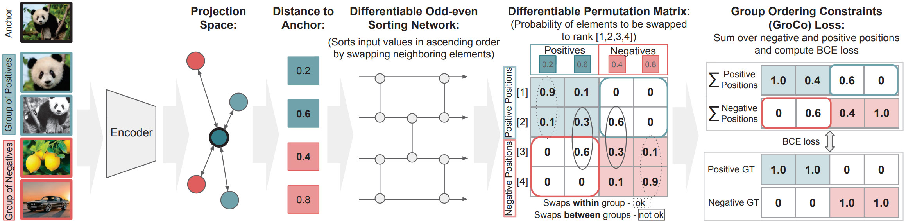

# Learning by Sorting: Self-supervised Learning with Group Ordering Constraints

<p align="center">
  
</p>

Official PyTorch implementation of the paper ["Learning by Sorting: Self-supervised Learning with Group Ordering Constraints"](https://arxiv.org/pdf/2301.02009).
In **ICCV 2023**

by [<ins>Nina Shvetsova</ins>](https://ninatu.github.io/), 
[<ins>Felix Petersen</ins>](https://petersen.ai/),
[<ins>Anna Kukleva</ins>](https://annusha.github.io/),
[<ins>Bernt Schiele</ins>](https://www.mpi-inf.mpg.de/departments/computer-vision-and-machine-learning/people/bernt-schiele),
[<ins>Hilde Kuehne</ins>](https://hildekuehne.github.io/).

[**[arxiv]**](https://arxiv.org/abs/2301.02009) / 
[**[paper]**](https://openaccess.thecvf.com/content/ICCV2023/papers/Shvetsova_Learning_by_Sorting_Self-supervised_Learning_with_Group_Ordering_Constraints_ICCV_2023_paper.pdf) / 
[**[supplement]**](https://openaccess.thecvf.com/content/ICCV2023/supplemental/Shvetsova_Learning_by_Sorting_ICCV_2023_supplemental.pdf)

## Motivation

Contrastive learning has become an important tool in learning representations from unlabeled data mainly relying on the idea of minimizing distance between positive data pairs, e.g., views from the same images, and maximizing distance between negative data pairs, e.g., views from different images. This paper proposes a new variation of the contrastive learning objective, Group Ordering Constraints (GroCo), that leverages the idea of sorting the distances of positive and negative pairs and computing the respective loss based on how many positive pairs have a larger distance than the negative pairs, and thus are not ordered correctly. To this end, the GroCo loss is based on differentiable sorting networks, which enable training with sorting supervision by matching a differentiable permutation matrix, which is produced by sorting a given set of scores, to a respective ground truth permutation matrix. Applying this idea to groupwise pre-ordered inputs of multiple positive and negative pairs allows introducing the GroCo loss with implicit emphasis on strong positives and negatives, leading to better optimization of the local neighborhood. We evaluate the proposed formulation on various self-supervised learning benchmarks and show that it not only leads to improved results compared to vanilla contrastive learning but also shows competitive performance to comparable methods in linear probing and outperforms current methods in k-NN performance.

## Pretrained models

For all models **backbone=ResNet50, batch size=1024**. More checkpoints can be found [here](https://drive.google.com/drive/folders/15BDFlBV_zNCb0bs7kdpzgG5QW3x_lnx1?usp=sharing) 
(all checkpoints with one zip file [here](https://drive.google.com/file/d/1MQotYbrAW40zZyx0aw5mVlIHMb24TQM5/view?usp=sharing) (4.4Gb)).

| Method  | PT epochs | Views        | k-NN (k=20) | Lin.p.(Top-1)| Checkpoint |
|---------|-----------|--------------|-------------|--------------|------------|
| GroCo   | 100       | 2 x 224      | 60.5        | 69.2         | [link](https://drive.google.com/file/d/1RbF28o8Vc5134uT_FiEIXy0olZ1PWh7p/view?usp=sharing)
| GroCo   | 200       | 2 x 224      | 62.9        | 70.4         | [link](https://drive.google.com/file/d/12b7Rm6F4bsYIxxWFUK05lTK2PdN3JJB9/view?usp=sharing)
| GroCo   | 400       | 2 x 224      | 63.6        | 71.1         | [link](https://drive.google.com/file/d/1OH9-ElB0XoQkzJzdyyFMQYPVTNe-skdI/view?usp=sharing)
| GroCo   | 800       | 2 x 224      | 65.3        | 71.2         | [link](https://drive.google.com/file/d/1gqNZJxHlbMWE-WiqauGR2XBvqSZ2JbgN/view?usp=sharing)
| GroCo   | 100       |**4 x 224**   | 61.8        | 69.6         | [link](https://drive.google.com/file/d/1-N-obhVQnPLLy_UCu8-a3mCBI_9rpI4u/view?usp=sharing)
| GroCo   | 200       |**4 x 224**   | 63.6        | 70.6         | [link](https://drive.google.com/file/d/1DdSbBBzpROVi8d9kXdbrlVnLCtiUS13r/view?usp=sharing)
| GroCo   | 400       |**4 x 224**   | 64.8        | 71.3         | [link](https://drive.google.com/file/d/1g24I0pkv-CB8Q_i6FHZk5C4OpPoMH9k7/view?usp=sharing)
| GroCo   | 100       |**2x224+6x96**| 62.3        | 71.8         | [link](https://drive.google.com/file/d/1y5_ghwWT9ZjZjPwMtTTPB2Dx72TAADj-/view?usp=sharing)
| GroCo   | 200       |**2x224+6x96**| 64.2        | 72.9         | [link](https://drive.google.com/file/d/1C1uxVYDx52JmIdkJgXXc-_LptHv8MXzP/view?usp=sharing)
| GroCo   | 400       |**2x224+6x96**| 65.2        | 73.7         | [link](https://drive.google.com/file/d/1aFZpgenrVA_yVk5IMB0XKVm3dOzCCewp/view?usp=sharing)
| GroCo   | 800       |**2x224+6x96**| 66.1        | 73.9         | [link](https://drive.google.com/file/d/1Y0bwMu9WK3zeiWPaUft5vSyZHm_MjM6_/view?usp=sharing)


## Get started

### Setup an environment

```shell
conda create python=3.7 -y -n learning_by_sorting
conda activate learning_by_sorting
conda install -y pytorch==1.10.2 torchvision==0.11.3 torchaudio==0.10.2 cudatoolkit=11.3 -c pytorch
conda install -y scikit-learn
pip install webdataset==0.1.103 tqdm psutil sacred humanize neptune-client==0.14.2 neptune-contrib==0.28.1
pip install diffsort
```

### Data preparation

For efficient I/O operations, we use [WebDataset](https://github.com/webdataset/webdataset) for data storing and data loading. 
However, the code also supports ImageNet stored in a conventional way (see `configs/examples/imagenet_folders.yaml` as the config example).

1. Download the ImageNet dataset from http://www.image-net.org/ to `data/imagenet/original` (ILSVRC2012_img_train.tar, ILSVRC2012_img_val.tar, ILSVRC2012_img_val.tar files)
2. (**Optional, but highly recommended**) Preprocess ImageNet into tar files with [WebDataset](https://github.com/webdataset/webdataset) convention:
```bash
    python preprocessing/create_tar_webdataset.py --input data/imagenet/original  --output  data/imagenet/processed
```
(After this, `data/imagenet/processed` should have subfolder `train` and `val`.)

### Configs

This repository uses yaml files to keep all hyperparameters. The `configs` folder contains configs for training and evaluation.  

### Experiment logging

This repository uses Sacred with a [neptune.ai](https://neptune.ai/) for logging and tracking experiments. If you want to activate this:

1. Create a [neptune.ai](https://neptune.ai/) account.
2. Create a project, copy in your credentials (api_token, project_name) in train.py
3. Add --neptune key to the training

### Running evaluation

#### k-NN evaluation
 
Evaluation of k-nearest neighbors classifier should be run on **single** GPU with 48Gb gpu memory 
(but uncommenting "compute_sim_on_cpu: true" in eval_knn.yaml will significantly reduce GPU memory usage). 
Note that the code does not support multi-GPU setup for k-NN evaluation with full-scale ImageNet (1.2M images).

Example:
```shell
python eval.py \
  --config configs/eval_knn.yaml \
  --resume pretrained/2views_100ep/latest_model.pth \
  --name eval_knn_2views_100ep \
  --gpu 0 \
  --neptune
```

We also perform *"online"* k-NN evaluation during training using only 30k examples as supervision, see `KNNEvaluator` in training configs. 

#### Linear probing 

Example (multi-gpu):
```shell
export MASTER_PORT=12345
export WORLD_SIZE=4
export MASTER_ADDR=localhost

torchrun --standalone --nnodes=1 --nproc_per_node=${WORLD_SIZE} \
    eval.py \
      --distributed \
      --world-size ${WORLD_SIZE} \
      --config configs/eval_linear_probing.yaml \
      --resume pretrained/2views_100ep/latest_model.pth \
      -name eval_lp_2views_100ep \
      --neptune
```

### Training

This repository supports both **multi-gpu** training (with **DistributedDataParallel**) and **single-gpu** training. 

#### Multi-GPU training: on one machine 

A typical command to pre-train ResNet50 on 4 GPUs on one machine 
(memory utilization: ~28GB on each GPU for 2 views setup):

```shell
export MASTER_PORT=12345
export WORLD_SIZE=4
export MASTER_ADDR=localhost

torchrun --standalone --nnodes=1 --nproc_per_node=${WORLD_SIZE} \
  train.py \
    --distributed \
    --world-size ${WORLD_SIZE} \
    --config configs/2views_100ep.yaml \
    --neptune
```

#### Multi-GPU training: SLURM cluster

```shell
export MASTER_PORT=12345
export WORLD_SIZE=4
export MASTER_ADDR=$(scontrol show hostnames "$SLURM_JOB_NODELIST" | head -n 1)

srun python train.py \
    --distributed \
    --world-size ${WORLD_SIZE} \
    --config configs/2views_100ep.yaml \
    --neptune
```

#### For debugging: one GPU example

```shell
python train.py \
  --config configs/examples/example.yaml \
  --gpu 0 \
  --neptune
```

#### Resume training

To resume training from the checkpoint use `--resume`:

```shell
torchrun --standalone --nnodes=1 --nproc_per_node=${WORLD_SIZE} \
  train.py \
    --distributed \
    --world-size ${WORLD_SIZE} \
    --config configs/2views_100ep.yaml \
    --resume pretrained/2views_100ep/latest_model.pth \
    --neptune

```
## Acknowledgments and licenses

The main structure of the code is based on
https://github.com/victoresque/pytorch-template, which is licensed under MIT. 

The code in knn.py, dist_utils.py, larc.py is partly derived from 
https://github.com/zhengyu-yang/lightning-bolts,
https://github.com/salesforce/BLIP,
https://github.com/NVIDIA/apex and is licensed under and Apache License 2.0 or BSD-3.

All other code is licensed under MIT. All license clauses are in the LICENSE file.

## Citation 

If you use this code in your research, please cite:

```
@Article{shvetsova2023learning,
  title   = {Learning by Sorting: Self-supervised Learning with Group Ordering Constraints},
  author  = {Shvetsova, Nina and Petersen, Felix and Kukleva, Anna and Schiele, Bernt and Kuehne, Hilde},
  journal = {ICCV},
  year    = {2023},
}
```
